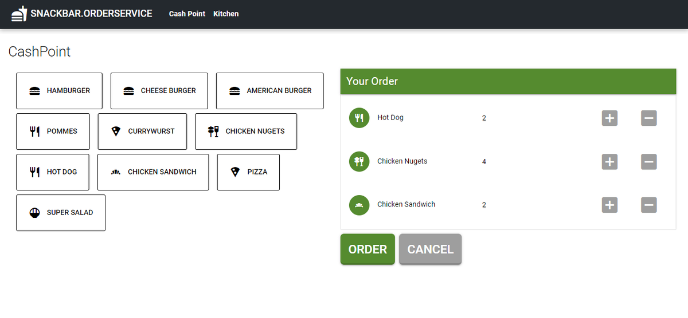

# SnackBar.OrderService

A simple system to display orders in the kitchen. The application runs in the browser, so it only needs one tablet in the kitchen and one at the checkout. The finished orders can then be marked as completed in the kitchen with a swipe motion.

